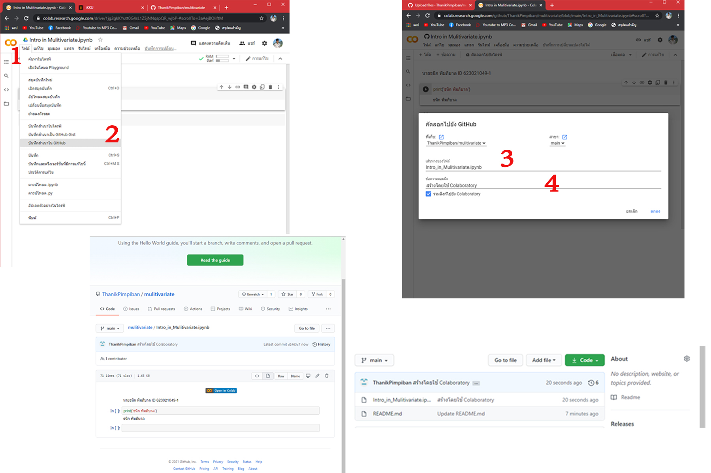

# mulitivariate

## ธนิก พิมภิบาล ID 623021049-1

.md => Markdown

อธิบายการใช้งาน Github และ google colab ว่าหน้าที่ของแต่ละอันคืออะไร และอธิบายวิธีเซฟไฟล์จาก google colab ลงใน github

## Github
คือ แหล่งรวมโค้ดไฟล์ที่สามารถแชร์ให้คนอื่นเข้ามาแก้ไขโค้ดหรือดูโค้ดได้

## google colab 
คือ อินเตอร์เฟดในการเขียนโค้ด

## การเซฟไฟล์จาก google colab ลงใน github 
คือ **1.file --> 2.บักทึกสำเนาใน github --> 3.ตั้งชื่อไฟล์ --> 4.ใส่ comment --> เสร็จ**

